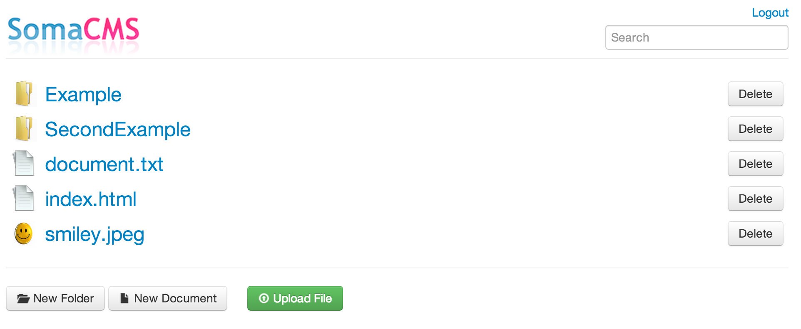

SomaCMS
=========
SomaCMS is a super-simple, user friendly content management system running on Java. It's almost misleading to call it a
 CMS. You can upload files, edit text documents in the browser and publish the results for easy access.

Yet another CMS. Why?
---------------------
I needed a simple CMS running on the Java stack. There are lot of nice, simple solutions written on PHP but I couldn't
find anything simple enough for Java.

I wanted to learn web development, so this project was as good an excuse as any.

What does *soma* mean?
----------------------
Soma means cute in Finnish.

Screenshots
-----------



Setup
-----
1. Check the configuration at `src/main/resources/somacms.properties`
2. Setup the database, e.g.
```sql
CREATE DATABASE somacms;
GRANT ALL ON somacms.* TO 'somacms'@'localhost' IDENTIFIED BY 'somacms';
```
3. Run locally: `mvn jetty-run`
4. Navigate to `http://localhost:8080/admin/

Notes
-----
To edit the Thymeleaf pages without a server, you'll need to enable local file access in your browser. See more info at
http://sourceforge.net/u/jjbenson/wiki/thymol/. For example, Chrome on OS X:
```bash
open -a "Google Chrome" --args --allow-file-access-from-files
```

Things I'm Not Too Proud Of
---------------------------
* No unit tests. Shame on me.
* The REST api could be a bit more consistent

Improvement Ideas
-----------------
* Add support for renaming files and folders
* Implement better user management
* Add version tracking for documents
* Export the whole database as an archive
* Convert to a single-page application e.g. using AngularJS
