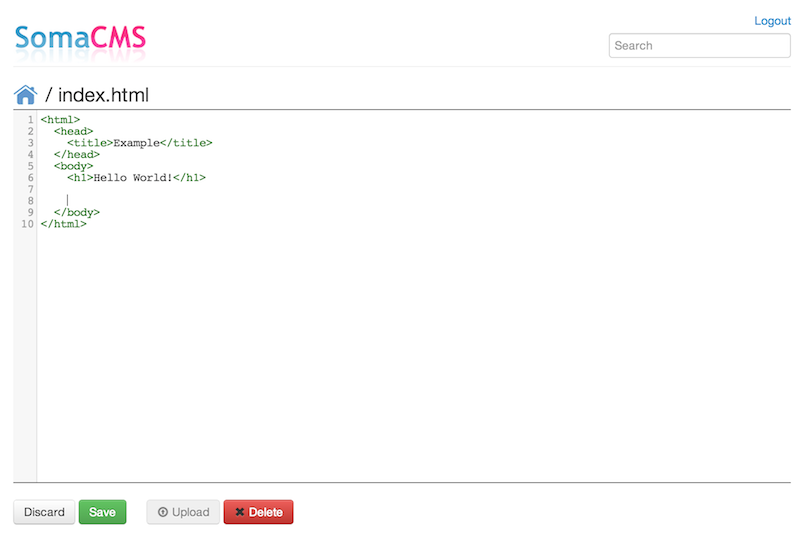

SomaCMS
=========
SomaCMS is a super-simple, user friendly content management system running on Java. It's almost misleading to call it a
 CMS. You can upload files, edit text documents in the browser and publish the results for easy access.

Yet another CMS. Why?
---------------------
I needed a very simple CMS. There seems to be a lot of nice, simple products written on PHP but I couldn't
find anything simple enough for Java.

I also wanted to learn some web development, so this project was as good an excuse as any. :)

What does *soma* mean?
----------------------
Soma means cute in Finnish. I felt there were already enough projects called SimpleCMS on GitHub.

Screenshots
-----------
### Main View with Folders


### Editor View


Demonstration
-------------
You can test SomaCMS at http://somacms.herokuapp.com/admin/. Both the username and the password are "admin".

Setup
-----
1. Check the configuration at `src/main/resources/somacms.properties`
2. Setup a MySQL database (see below)
3. Run locally: `mvn -Dsomacms.properties=classpath:somacms.properties jetty:run`
4. Navigate to `http://localhost:8080/admin/`

```mysql
CREATE DATABASE somacms;
GRANT ALL ON somacms.* TO 'somacms'@'localhost' IDENTIFIED BY 'somacms';
```

Notes
-----
* SomaCMS uses [Project Lombok](http://projectlombok.org/). If you see errors in IDEA, you should download the Lombok Plugin.
* To edit the Thymeleaf pages without a server, you'll need to enable local file access in your browser. See more info at
http://sourceforge.net/u/jjbenson/wiki/thymol/. For example, Chrome on OS X: `open -a "Google Chrome" --args --allow-file-access-from-files`
* The master branch requires MySQL but the Heroku branch has been converted to support PostgreSQL

Improvement ideas
-----------------
* Write some Unit Tests. Shame on me.
* Add support for renaming files and folders
* Implement better user management
* Add version tracking for documents
* Export the whole database as an archive
* Convert to a single-page application e.g. using AngularJS
* Add support for WYSIWYG editing


License
-------
This software is released under the [MIT License](MIT-LICENSE.txt).